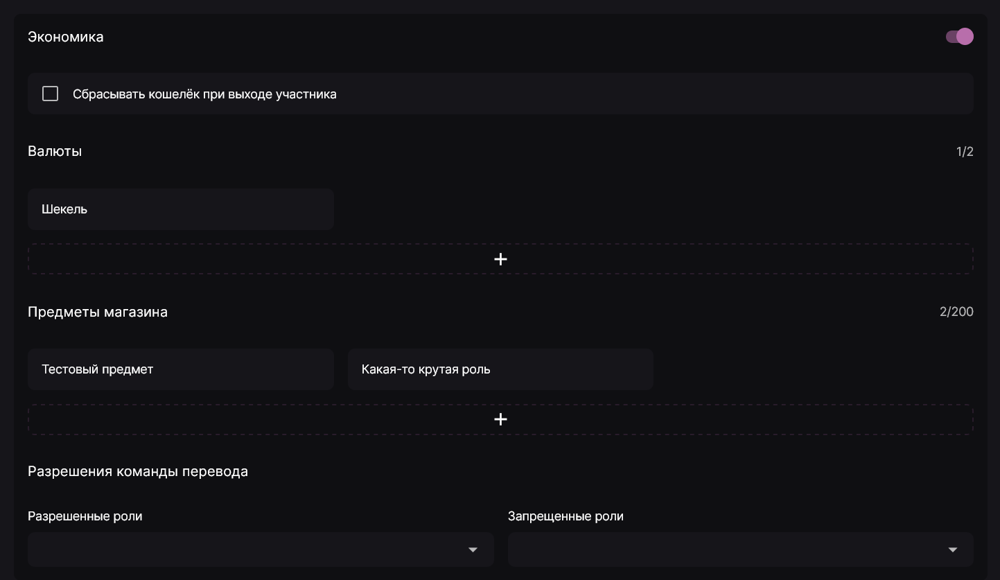

Модуль экономики позволяет вам и участникам вашего сервера получать серверную валюту за активность, а затем тратить её на предметы внутрисерверного магазина или переводить между собой.

Настройки этого модуля находятся в панели управления на вкладке **Активности**, откуда нужно прокрутить вниз до блока **Экономика**.

## Настройки экономики \{#settings}

Первый параметр - **Сбрасывать кошелёк при выходе участника** - действует аналогично параметру **Сбрасывать уровень при выходе участника** для уровней. При выходе участника с сервера его кошелёк автоматически обнулится и при возвращении на сервер ему будет необходимо снова накапливать валюту.

### Валюты \{#currencies}

Валюты и являются тем элементом, что будут копить участники. Лакуна позволяет иметь на сервере до двух валют, но валюта по умолчанию присутствует всегда и её нельзя удалить, в отличие от второй.

У каждой из валют имеются следующие параметры:

- Название и символ: используются при отображении баланса участника и цен в магазине сервера.
- Заработок за сообщение: минимальное и максимальное количество валюты, которое участник сможет заработать за одно соообщение.
- Временное ограничение: период времени, по истечению которого участник снова сможет получить валюту. Используется для предотвращения чрезмерного заработка с помощью флуда сообщениями.
- Заработок за минуту в голосовом канале: минимальное и максимальное количество валюты, которое участник сможет заработать за одну минуту в голосовом канале.

:::note Ограничения

Заработок валюты в голосовых каналах доступен только с подпиской **Lacuna Diamond**.

:::

- Разрешения: перечень разрещённых/запрещённых каналов/ролей для начисления валюты. Подробнее о том, как работают эти перечни см. [Разрешения](../guides/permissions.mdx).

### Предметы магазина \{#store-items}

Здесь вы можете указать предметы, которые участники затем будут покупать. Разберём настройки каждого из предметов:

- Название и описание: отображаются при просмотре магазина участником.
- Тип: определяет тип выдаваемого предмета - роль или доступ к каналу.
- Цена покупки: цена и валюта предмета.
- Товары: перечень каналов или ролей, которые будут выданы участнику.
- Ограниченное количество: возможность сделать предмет лимитированным, т.е. установить количество покупок, после которых предмет будет числиться как недоступный для покупки. Этот параметр можно изменить позже.
- Выдавать роли временно: указывает, на какой период выдавать роль. Доступно только для типа предмета **Роль**.
- Индивидуальное сообщение покупки: опция для указания пользовательского сообщения, которое будет отправлено при покупке. Подробнее о его настройке см. [Шаблоны сообщений](../guides/message-templates.mdx).

### Разрешения команды перевода \{#transfer-command-permissions}

Данный параметр определяет, каким ролям будет разрешено или запрещено пользоваться командой перевода средств. Подробнее о том, как работают эти перечни см. [Разрешения](../guides/permissions.mdx).
