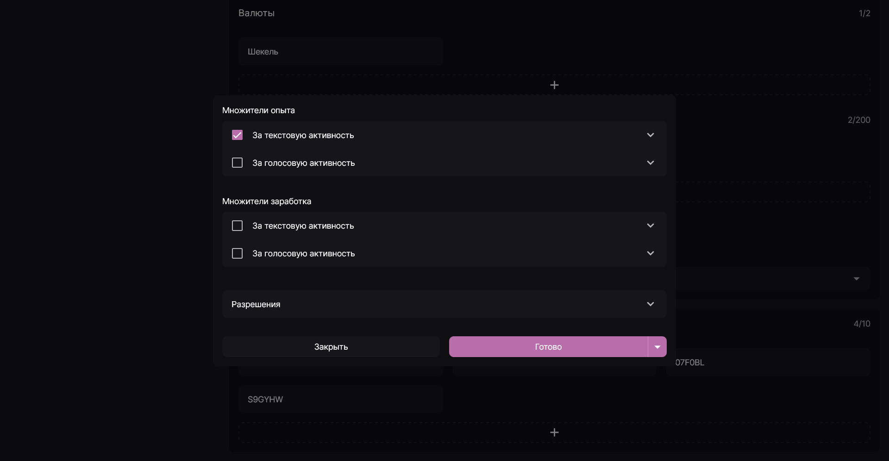

Множители позволяют вам контролировать, как быстро или медленно участники будут получать опыт и серверную валюту за текстовую и голосовую активность. При этом эти настройки являются очень гибкими и позволяют вам ограничить конкретный множитель для определённых каналов и/или ролей, а также установить отдельную скорость начисления опыта/заработка для каждого из типов активности.

Для ознакомления с уже имеющимися множителями и создания новых перейдите на вкладку **Активности** и прокрутите вниз до блока **Множители опыта и заработка**.

Открыв окно настройки множителя, вы можете указать:

1. Область его действия. Для этого отметьте флажок напротив типа (типов) активности, к которым нужно применить множитель, а затем укажите скорость начисления, раскрыв каждый из пунктов.

:::tip

Скорость начисления опыта/заработка измеряется в процентах относительно настроек по умолчанию. Возможна установка значения от 50% до 500%. Значение по умолчанию - 100%.

:::

2. Разрешения. Вы можете указать перечень разрещённых/запрещённых каналов/ролей для более гибкой настройки множителя. Подробнее о том, как работают эти перечни см. [Разрешения](../guides/permissions.mdx).

:::note

В бесплатной версии возможно настроить только 1 множитель. При активации подписки **Lacuna Diamond** их количество увеличивается до 10.

:::
