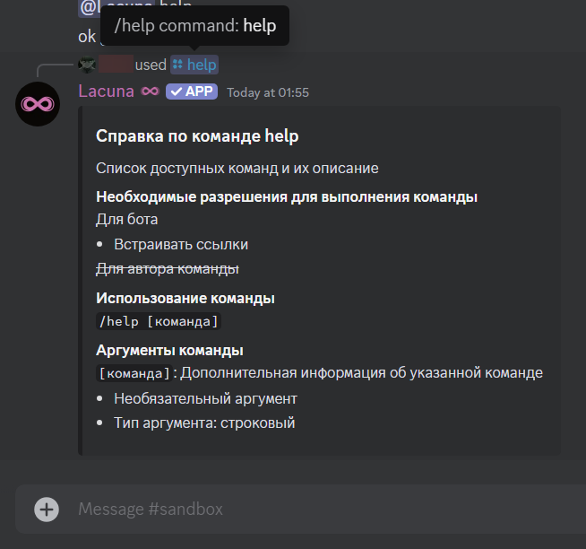

## Список команд \{#command-list}

Со списком команд можно ознакомиться:

- в панели управления в разделе "Команды";
- использовав команду `/help` на сервере. _Замечание: эта команда показывает и встроенные, и пользовательские команды, но не показывает те, что были отключены в панели управления._

## Префикс \{#prefix}

У Лакуны нет префикса в привычном понимании - она использует слеш-команды вместо текстовых. Следовательно, "префикс" у бота - `/`. Это применимо как к встроенным командам, так и к пользовательским.

## Управление командами \{#command-management}

Встроенными командами можно управлять в панели управления в разделе "Команды". Нажав на любую из перечисленных команд, вы сможете настроить некоторые опции, такие как включение/отключение команды и ограничение использования.

Кроме того, вы можете добавлять переопределения прав для отдельных ролей, каналов и команд в настройках вашего сервера. Для этого перейдите в раздел **Интеграции**, выберите Lacuna и установите необходимые переопределения в открывшемся списке команд. Данные переопределения, однако, не касаются участников с правом администратора - они всегда смогут выполнять все команды в любых каналах.

## Справка по команде \{#command-help}

Ознакомиться с информацией о конкретной команде можно, введя `/help [название команды]`:

### Необходимые разрешения \{#command-permissions}

В детальной информации о команде перечислены права, необходимые Лакуне ("Для бота") и автору команды ("Для автора команды") для успешного выполнения. Если один из этих пунктов перечёркнут, значит, боту или автору не требуются какие-либо особые права.

### Использование команды \{#command-usage}

Описывает, как использовать данную команду и приводит все доступные аргументы.

### Аргументы команды \{#command-arguments}

Список всех аргументов команды с их описанием, указанием типа и необходимости использования (обязательный/необязательный).

## Аргумент длительности \{#duration-argument}

Аргумент длительности является специальным строковым аргументом, который используется для указания длительности какого-либо действия.

### Формат \{#duration-argument-format}

`<число><буква>`

Число – это количество минут/часов/дней и т.д. Число необязательно должно быть целым - можно использовать `0.5h` для указания 30 минут (полчаса).

Буква влияет непосредственно на то, в чём будет измеряться время — в секундах, минутах, часах и т.п.

Число и букву нужно писать слитно.

### Доступные величины \{#duration-argument-units}

| Типы                                                 | Величина     |
| ---------------------------------------------------- | ------------ |
| `ms`, `msec`, `msecs`, `millisecond`, `milliseconds` | Миллисекунды |
| `s`, `sec`, `secs`, `second`, `seconds`              | Секунды      |
| `m`, `min`, `mins`, `minute`, `minutes`              | Минуты       |
| `h`, `hr`, `hrs`, `hour`, `hours`                    | Часы         |
| `d`, `day`, `days`                                   | Дни          |
| `w`, `week`, `weeks`                                 | Недели       |
| `y`, `yr`, `yrs`, `year`, `years`                    | Годы         |

### Примеры \{#duration-argument-examples}

- `30s` — 30 секунд
- `15m` — 15 минут
- `0.25d` — 6 часов
- `12h` — 12 часов
- `2w` — 2 недели
