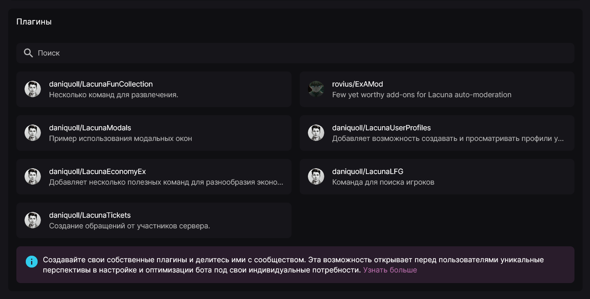
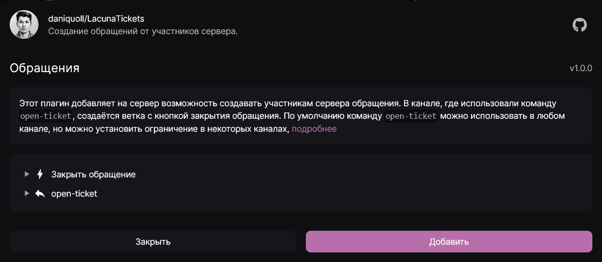

Помимо возможности создания пользовательских команд и автоматизаций для своего сервера, Лакуна также имеет каталог плагинов, которые можно добавлять к себе на сервер.

**Плагин** - это набор пользовательских команд и/или автоматизаций, расширяющих возможности Лакуны.

Сам каталог вы можете найти в панели управления на вкладке **"Пользовательское поведение"** в блоке **"Плагины"**.

Нажав на любой из представленных плагинов, вы увидите его описание, а также список файлов, которые в него входят, например:

Для добавления плагина к себе на сервер просто нажмите кнопку **"Добавить"**. Затем для каждого элемента плагина появится подтверждение, хотите ли вы его добавить. Вы можете как согласиться, так и отказаться, если какой-либо компонент плагина вам не нужен.

Стоит также отметить, что со стороны Лакуны целостность плагина не проверяется, что позволяет вам удалять или добавлять его компоненты и после установки.

Если вы хотите добавить свой плагин в каталог, ознакомьтесь со страницей [Внести вклад](../guides/contributing.mdx).
