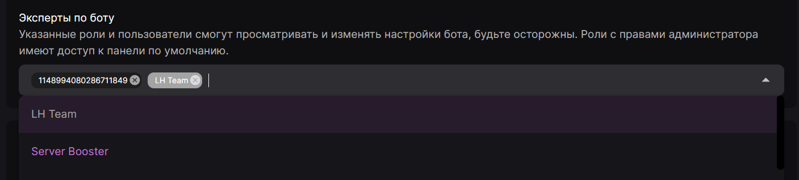
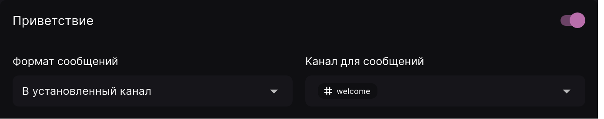
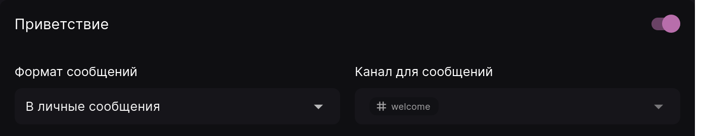
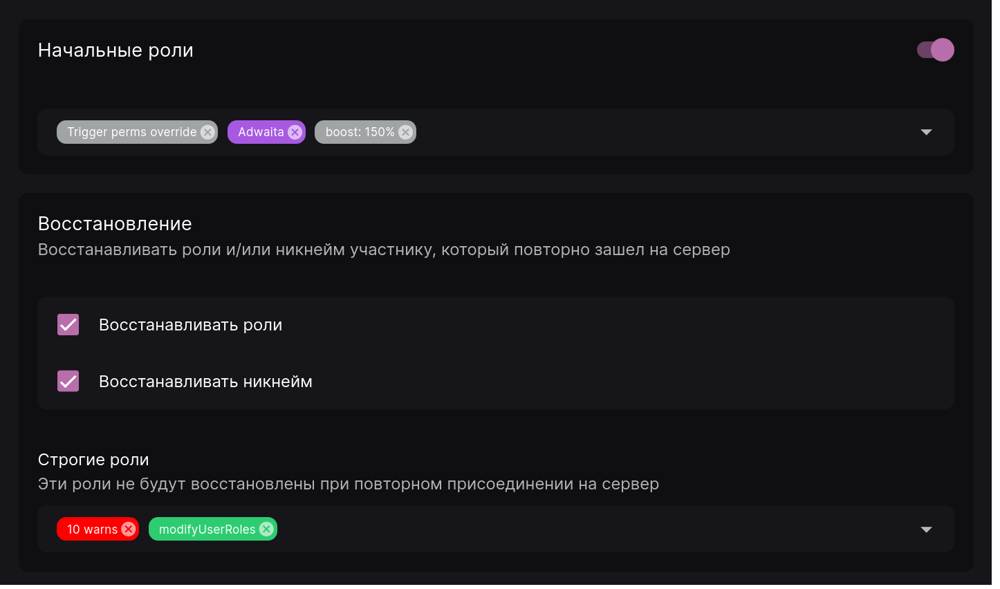
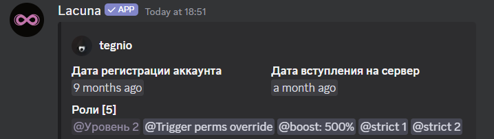
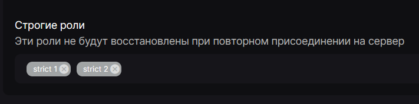

## Локализация \{#localization}

Этот параметр отвечает за язык, который будет использоваться в сообщениях бота, отправляемых на сервере. Данный параметр не затрагивает сообщения, настраиваемые вручную в панели.

## Эксперты по боту \{#bot-experts}

"Эксперты по боту" - это перечень ролей и пользователей, которые могут получить доступ к настройкам бота для данного сервера и изменять их. По умолчанию, если перечень пустой, такие полномочия предоставляются владельцу сервера и участникам с правом администратора.

:::warning Будьте осторожны!

Не давайте доступ к панели управления тем людям, которым вы не доверяете. Данная функция даёт **полный** доступ к настройкам, и при небрежном обращении может привести к серьёзным последствиям.

:::

## Приветственное сообщение \{#greeting-message}

Это сообщение, которое будет отправлено при его присоединении к серверу.
Существует два способа отправить сообщение: в установленный канал на сервере или в личные сообщения.

### Отправка сообщения на сервер \{#greeting-message-server}

Для отправки приветственного сообщения на сервер установите формат сообщений "В установленный канал" и выберите необходимый канал на сервере.

:::note Помните!

Бот должен иметь соответствующие права на сервере или на отдельном канале для корректной отправки сообщения.

- Для отправки обычного сообщения - _Отправлять сообщения_
- Для отправки встроенного сообщения - также _Встраивать ссылки_
- Для отправки изображения - также _Прикреплять файлы_

:::

### Отправка в личные сообщения \{#greeting-message-dm}

Если вы не хотите, например, засорять сервер приветственными сообщениями, вы можете установить отправку в личные сообщения. Однако учтите, что сообщение не сможет быть отправлено, если у пользователя в настройках конфиденциальности отключен прием личных сообщений.

Обратите внимание, что при выборе формата "В личные сообщения" поле выбора канала становится неактивным, но последнее выбранное значение сохраняется. Оно будет использовано, если вы снова установите режим "В установленный канал"

После выбора формата отправки вы можете настроить само сообщение, которое будет отправлено. В этом вам поможет [руководство по шаблонам сообщений](guides/message-templates.mdx).

## Начальные роли \{#initial-roles}

Функция "Начальные роли" позволяет автоматически выдавать роли участникам при их присоединении к серверу.

Для настройки данного параметра откройте панель управления на вкладке "Общее" и прокрутите вниз до параметра "Начальные роли". Затем выберите необходимые роли и сохраните изменения. После этого каждому новоприбывшему участнику будут выдаваться указанные роли.

:::warning Обратите внимание!

Лакуна не сможет выдать указанные роли, если:

- после их установки одна или несколько ролей были перемещены выше роли бота;
- на сервере включён показ правил и участник их не принял.

:::

## Восстановление \{#roles-restoring}

Кроме выдачи ролей при присоединении, Лакуна может возвращать роли и никнейм тем участникам, которые ранее находились на сервере. Для этого вы можете отметить галочки "Восстанавливать никнейм" и "Восстанавливать роли".

Эта функция будет восстанавливать роли/никнейм только тем участникам, которые выходили с сервера в тот момент, когда была добавлена Лакуна и включено восстановление ролей/никнеймов в панели управления.

### Строгие роли \{#strict-roles}

Существует также параметр "Строгие роли". Он позволяет указать роли, которые **не будут** восстановлены при повторном присоединении участника к серверу.

Рассмотрим пример. Участник на момент выхода имел следующие роли:

В это же время были настроены "Строгие роли" следующим образом:

После того, как участник вышел с сервера и зашёл обратно, у него будут восстановлены все роли, которые у него были, кроме тех, что были указаны в параметре "Строгие роли":

Учтите, что данный параметр работает только при включённом "Восстановлении ролей". Если эта галочка не отмечена в панели управления, то и "Строгие роли" работать не будут.

## Прощальное сообщение \{#farewell-message}

Прощальное сообщение, напротив, отправляется при выходе участника с вашего сервера. Оно настраивается так же, как и привественное сообщение, требует для работы такие же права и может быть отправлено либо на сервер, либо в личные сообщения участнику.

Однако, в отличие от приветственого сообщения, в некоторых случаях бот не сможет доставить сообщение, если оно отправляется в личные сообщения:

- если у участника не осталось с Лакуной общих серверов, или
- если у участника остались общие с Лакуной серверы, но на них в настройках конфиденциальности со стороны пользователя отключен прием личных сообщений.
