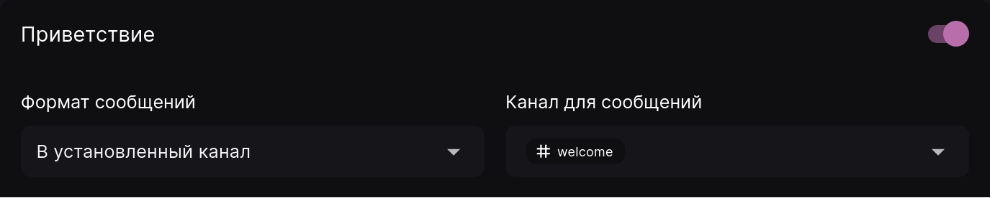
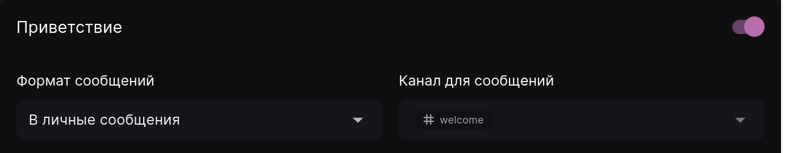

Функции "Приветствие" и "Прощание" позволяет оформить красивые приветственные и прощальные сообщения для посетителей Вашего сервера. Lacuna позволяет отдельно настроить сообщения, которые будут отправлены при присоединении и выходе участника.

## Приветственное сообщение {#greeting-message}

Это сообщение, которое будет отправлено при его присоединении к серверу.
Существует два способа отправить сообщение: в установленный канал на сервере или в личные сообщения.

### Отправка сообщения на сервер

Для отправки приветственного сообщения на сервер установите формат сообщений "В установленный канал" и выберите необходимый канал на сервере.

:::note Помните!

Бот должен иметь соответствующие права на сервере или на отдельном канале для корректной отправки сообщения.

- Для отправки обычного сообщения - _Отправлять сообщения_
- Для отправки встроенного сообщения - также _Встраивать ссылки_
- Для отправки изображения - также _Прикреплять файлы_

:::

### Отправка в личные сообщения

Если вы не хотите, например, засорять сервер приветственными сообщениями, вы можете установить отправку в личные сообщения. Однако учтите, что сообщение не сможет быть отправлено, если у пользователя в настройках конфиденциальности отключен прием личных сообщений.

Обратите внимание, что при выборе формата "В личные сообщения" поле выбора канала становится неактивным, но последнее выбранное значение сохраняется. Оно будет использовано, если вы снова установите режим "В установленный канал"

После выбора формата отправки вы можете настроить само сообщение, которое будет отправлено. В этом вам поможет [руководство по шаблонам сообщений](../guides/message-templates.md).

## Прощальное сообщение {#farewell-message}

Прощальное сообщение, напротив, отправляется при выходе участника с вашего сервера. Оно настраивается так же, как и привественное сообщение, требует для работы такие же права и может быть отправлено либо на сервер, либо в личные сообщения участнику.

Однако, в отличие от приветственого сообщения, в некоторых случаях бот не сможет доставить сообщение, если оно отправляется в личные сообщения:

- если у участника не осталось с Лакуной общих серверов, или
- если у участника остались общие с Лакуной серверы, но на них в настройках конфиденциальности со стороны пользователя отключен прием личных сообщений.
