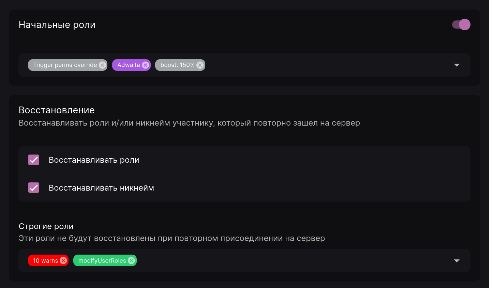
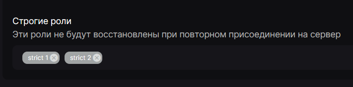
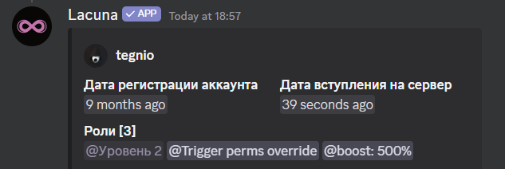

Функция "Начальные роли" позволяет автоматически выдавать роли участникам при их присоединении к серверу.

Для настройки данного параметра откройте панель управления на вкладке "Общее" и прокрутите вниз до параметра "Начальные роли". Затем выберите необходимые роли и сохраните изменения. После этого каждому новоприбывшему участнику будут выдаваться указанные роли.

:::warning Обратите внимание!

Лакуна не сможет выдать указанные роли, если:

- после их установки одна или несколько ролей были перемещены выше роли бота;
- на сервере включён показ правил и участник их не принял.

:::

## Восстановление {#restoring-roles}

Кроме выдачи ролей при присоединении, Лакуна может возвращать роли и никнейм тем участникам, которые ранее находились на сервере. Для этого вы можете отметить галочки "Восстанавливать никнейм" и "Восстанавливать роли".

Эта функция будет восстанавливать роли/никнейм только тем участникам, которые выходили с сервера в тот момент, когда была добавлена Лакуна и включено восстановление ролей/никнеймов в панели управления.

### Строгие роли {#strict-roles}

Существует также параметр "Строгие роли". Он позволяет указать роли, которые **не будут** восстановлены при повторном присоединении участника к серверу.

Рассмотрим пример. Участник на момент выхода имел следующие роли:

В это же время были настроены "Строгие роли" следующим образом:

После того, как участник вышел с сервера и зашёл обратно, у него будут восстановлены все роли, которые у него были, кроме тех, что были указаны в параметре "Строгие роли":

Учтите, что данный параметр работает только при включённом "Восстановлении ролей". Если эта галочка не отмечена в панели управления, то и "Строгие роли" работать не будут.
