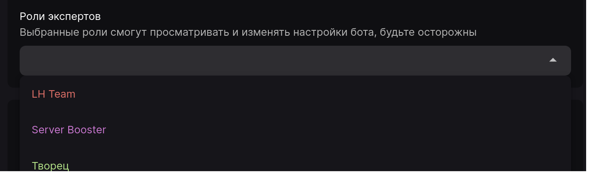

"Роли экспертов" - это список ролей, которые могут получить доступ к настройкам бота для данного сервера и изменять их. Участнику для получения доступа нужна одна любая роль из тех, что вы укажете. Кроме того, по умолчанию такие полномочия предоставляются владельцу сервера и участникам с правом администратора.

:::warning Будьте осторожны!

Не давайте доступ к панели управления тем людям, которым вы не доверяете. Данная функция даёт **полный** доступ к настройкам, и при небрежном обращении может привести к серьёзным последствиям.

:::
