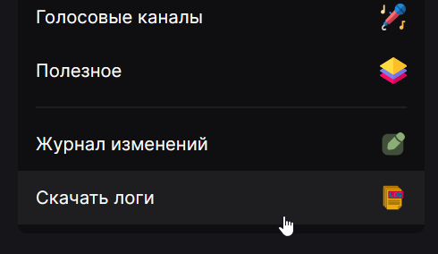

Функция "Скачать логи" используется как для наблюдения за ошибками при создании пользовательских команд и автоматизаций, так и для упрощения работы со службой поддержки.

Если ваша проблема ранее ни у кого не встречалась или имеет неочевидное решение, служба поддержки может попросить вас отправить логи сервера, где наблюдается проблема. Для этого необходимо:

1. Зайти в панель управления;
2. В панели слева выбрать самый последний пункт "Скачать логи";
   
3. Сохранить файл с расширением `.log`, который браузер предлагает скачать;
4. Вернуться в Discord и загрузить в ветку этот файл.
