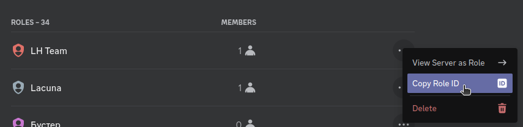
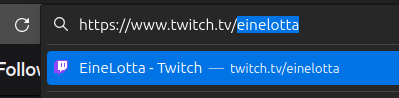

## Discord \{#discord}

### Активация "Режима разработчика" \{#discord-developer-mode}

Перед началом нужно включить или убедиться, что в настройках учетной записи Discord включен режим разработчика.

**Как это сделать?**

Перейдите в настройки учетной записи Discord

Снизу вы увидите расширенные настройки, перейдите туда

В самом низу будут расширенные настройки. Вам нужно будет оставить переключатель **Режим разработчика** активным

### Идентификаторы в контекстном меню \{#discord-context-menu}

Вы можете нажать правой кнопкой на сервер, канал, роль или участника сервера, и снизу в контекстном меню у вас будет пункт **Копировать ID**. Нажмите на этот пункт, чтобы получить идентификатор.

import TabItem from '@theme/TabItem';
import Tabs from '@theme/Tabs';

<Tabs>
  <TabItem value="copy-id-channel" label="Канал" default>
    
  </TabItem>
  <TabItem value="copy-id-member" label="Участник">
    
  </TabItem>
  <TabItem value="copy-id-role-settings" label="Роль (из настроек сервера)">
    
  </TabItem>
  <TabItem value="copy-id-role-user" label="Роль (из профиля)">
    
  </TabItem>
  <TabItem value="copy-id-server" label="Сервер">
    
  </TabItem>
</Tabs>

### Идентификаторы в поле сообщения \{#discord-message-field}

Вы также можете получить идентификаторы через поле ввода сообщения. Введите название эмоджи, пользователя, канала или роли в текстовое поле сообщения и напишите перед названием `\` (обратный слеш)

## Telegram \{#telegram}

### Публичный (открытый) канал \{#telegram-public}

Если канал, который вы хотите добавить, является публичным, то просто скопируйте его ссылку. Из полной ссылки вида `https://t.me/voidlacunatest1` нам нужно только `voidlacunatest1`.

### Приватный (закрытый) канал \{#telegram-private}

Для закрытых каналов используются другие методы получения идентификатора. Существует два способа получить его: через веб- и настольную версию приложения.

:::note

Идентификатор `1234567890` приведён лишь для примера. В обоих методах вместо него вы будете видеть идентификатор выбранного вами канала.

:::

#### Веб-версия \{#telegram-private-web}

1. Перейдите на страницу [https://web.telegram.org/](https://web.telegram.org/)
2. Откройте нужный канал
3. В адресной строке (`web.telegram.org/a/#-1234567890`) скопируйте `1234567890` после `/a/#-`
4. Добавьте `-100` в начало `-1001234567890`

Это и будет идентификатор канала.

#### Настольная версия \{#telegram-private-desktop}

1. Откройте боковое меню приложения
2. Перейдите в раздел "Настройки"
3. Откройте "Продвинутые настройки"
4. Прокрутите вниз до пункта "Экспериментальные настройки"
5. Включите параметр "Show Peer IDs in Profile"
6. Вернитесь в список чатов и выберите нужный канал
7. Откройте информацию о канале
8. В описании канала появится строчка _`id: 1234567890`_. Нажмите на идентификатор, он будет скопирован
9. Добавьте `-100` в начало `-1001234567890`

Это и будет идентификатор канала.

## Twitch \{#twitch}

Идентификатором канала Twitch является имя пользователя. Чтобы получить его, откройте в браузере необходимый канал и скопируйте часть после `twitch.tv/`.

## YouTube \{#youtube}

Идентификаторы каналов YouTube бывают двух видов: на платформе они называются "Псевдоним" и "Уникальный идентификатор канала". Для добавления оповещения подойдёт любой из них.

### Псевдоним \{#youtube-handle}

Псевдоним канала находится на странице канала под его именем.

### Уникальный идентификатор \{#youtube-unique-id}

Для некоторых каналов также можно скопировать уникальный идентификатор. Вы сможете найти его в адресной строке, если URL начинается с `youtube.com/channel/`.

