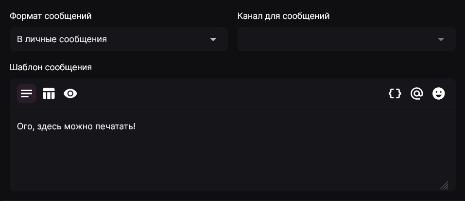

Во многих пунктах настроек Лакуны вы могли видеть подобное окно:

Это - шаблон сообщения. В данном руководстве описывается, как он устроен и какие возможности предлагает.

## Настройки отправки сообщения \{#send-message-options}

Актуально для сообщений о повышении уровня, приветственных и прощальных сообщений.

Эти параметры позволяют выбрать, куда будет отправлено сообщение - в личные сообщения участнику сервера или в канал на сервере. Если выбран вариант **"В установленный канал"**, то вам будет предложено выбрать канал на сервере для отправки сообщений.

## Параметры составления сообщения \{#message-compose-options}

Эти параметры отвечают за составление самого сообщения. Доступно 4 опции:

1. Обычный текст - указание обычного текста для отправки.
2. Встроенное сообщение - управление встроенным сообщением (включение/выключение), а также настройка его полей.
3. Операционные ряды - добавление операционных рядов с кнопками и выпадающими списками. **Только для пользовательских команд и автоматизаций.**
4. Предпросмотр сообщения.

## Опции вставки \{#paste-options}

Данные кнопки отвечают за вставку содержимого в текст.

1. Вставка заменителей и функций.
2. Вставка упоминаний ролей и каналов.
3. Вставка встроенных и пользовательских эмоджи.
