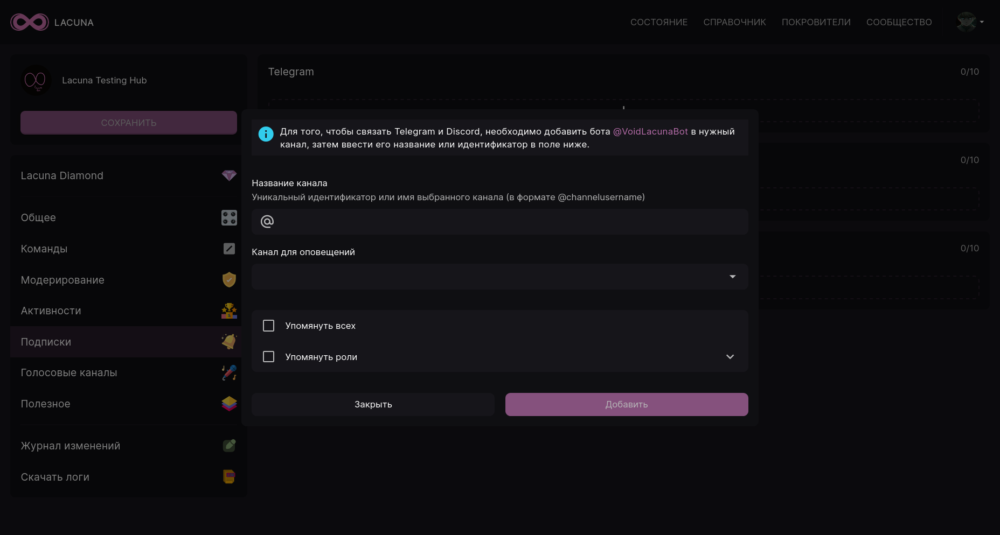
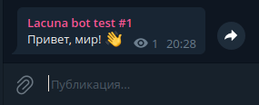
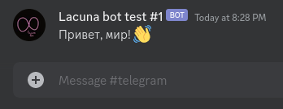
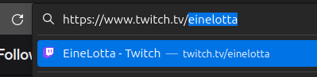
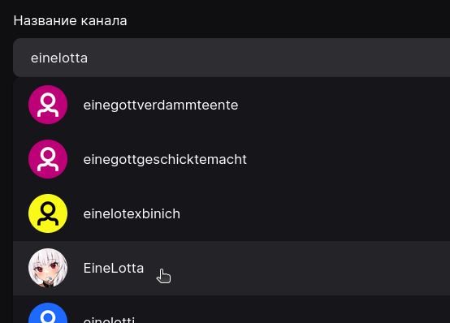
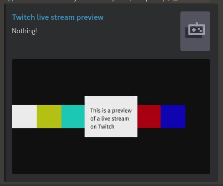

# Социальные оповещения

Социальные оповещения позволяют вам отслеживать каналы Telegram, Twitch и YouTube прямо на вашем Discord-сервере. Когда на каком-либо из добавленных каналов появится новая запись, видео или начнётся прямая трансляция, Лакуна оповестит вас и участников вашего сервера в заданном канале.

Настройка и управление происходит в панели управления на вкладке **Социальные оповещения**.

</img>

:::info

Бесплатный функционал Lacuna позволяет добавлять по одному оповещению для каждой из перечисленных выше платформ. Активировав подписку Lacuna Diamond, вы сможете добавлять до 10 оповещений на каждую из платформ.

:::

Рассмотрим добавление подписки для каждой из поддерживаемых платформ.

## Telegram

Для добавления подписки на канал Telegram нужно сначала добавить Лакуну в необходимый Telegram-канал. Для этого:

1. Откройте в Telegram необходимый канал;
2. Перейдите в настройки канала ("управление каналом");
3. Откройте раздел "Подписчики" и нажмите кнопку "Добавить пользователей";
4. В строке поиска введите _@VoidLacunaBot_, выберите бота Lacuna и подтвердите его присоединение к каналу.

После добавления бота в Telegram нажмите на **+** в панели управления.

</img>

В "Название канала" вам нужно ввести имя выбранного канала, т.е. то, что идёт после `t.me/` в его ссылке. В нашем примере ссылка на канал - `https://t.me/voidlacunatest1`, значит, именем канала будет `voidlacunatest1`.

В поле "Канал для оповещений" вам нужно выбрать канал на сервере, в который Лакуна будет пересылать сообщения. Также вы можете добавить к сообщению упоминание всех участников (@everyone) или отдельных ролей (максимум 3). В данном случае к пересылаемым сообщениям будут добавляться упоминания выбранных вами ролей.

После завершения настройки нажмите кнопку Добавить. Подписка появится в панели управления, а на сервере в выбранном канале Лакуна создаст вебхук. Теперь вы можете написать что-либо в Telegram канал, и Лакуна отправит это сообщение в Discord:

</img>

</img>

:::danger

Лакуна не сможет переслать сообщение из канала, если:

- Размер прилагаемого файла превышает 5 мб;
- Длина сообщения больше 2000 символов. В данном случае Лакуна обрежет его и оставит ссылку на исходную запись в конце.

:::

## Twitch

Подписки Twitch добавляются следующим образом.

Для начала откройте окно добавления Twitch-канала в панели управления. Затем откройте нужный канал на Twitch и скопируйте его имя.

Вставьте скопированное имя пользователя в поле "Название канала" **и выберите необходимый канал из списка**:

</img>

В поле "Канал для оповещений" укажите канал, в который будут поступать уведомления о начале прямой трансляции.

Затем, если необходимо, отметьте галочкой поле "Показывать предпросмотр стрима". Если данная опция включена, то Лакуна будет добавлять предпросмотр трансляции к каждому уведомлению:

</img>

В "Текст оповещения" указывается сообщение, которое отправляет бот в заданный канал. Оно может включать [заменители категории "Подписки"](../useful/replacers/#subscriptions).

## YouTube

Подписки YouTube работают точно таким же образом, как и Twitch, однако учтите следующие моменты:

1. В случае с YouTube уведомления отправляются не только для прямых трансляций, но также для видео и Shorts;
2. YouTube имеет два вида идентификаторов: старые (24 символа, начинаются с `UC`) и новые (начинаются с `@`). При добавлении подписки можно указать любой из них.
