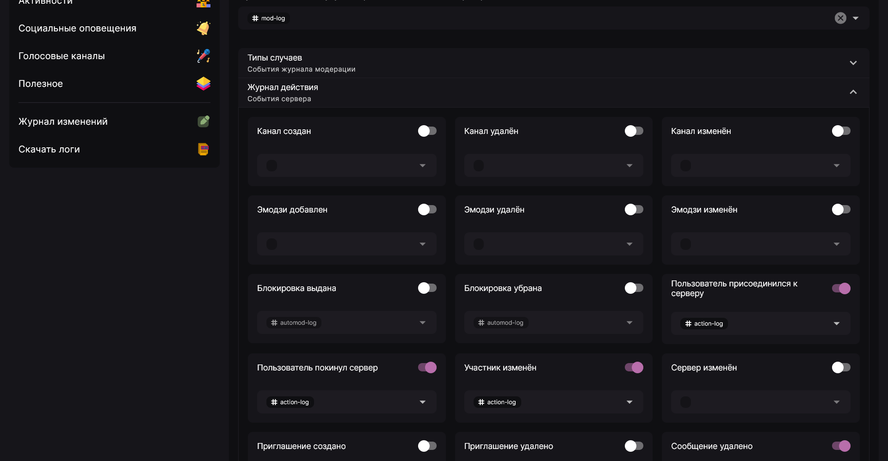

Журнал действий позволяет вам записывать события, в основном не связанные с модерацией, в отдельный канал на сервере. Кроме того, с помощью этой функции вы сможете дополнительно логировать некоторые действия модерации

Для его настройки откройте вкладку "Модерирование" в панели управления и прокрутите вниз до блока "Журнал" - там вы найдёте пункт "Журнал действий". При его открытии появляется список действий, которые можно включать и выключать по отдельности. Для каждого из перечисленных событий можно также настроить канал для отправки оповещений.

