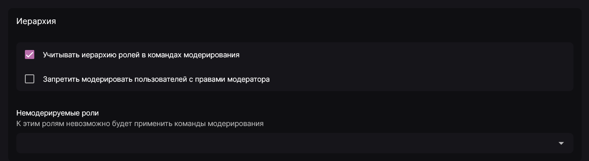

На первый взгляд принцип работы иерархии прав и ролей в Discord может показаться предельно понятным, однако есть некоторые нюансы, которые мы и затронем в этой статье. Мы также рассмотрим, с какими правилами права следуют иерархии, и отдельно отметим переопределения прав ролей и участников.

## Иерархия прав и ролей \{#hierarchy}

У каждого участника, в том числе и у ботов, имеется высшая роль, она же топ-роль. Здесь подробного объяснения не нужно - эта та роль, которую имеет участник (бот) и которая находится выше всех в списке его ролей. При этом по умолчанию у каждого участника имеется роль **@everyone**, которая всегда является самой низшей ролью сервера и присваивается всем участникам без возможности её убрать. Интерфейс Discord при этом показывает, что у участника "нет ролей", но здесь подразумевается наличие **@everyone**.

Права следуют иерархии со следующими правилами (рассмотрим на примере бота):

1. Бот может выдавать роли другим пользователям, которые находятся на более низкой позиции, чем его собственная высшая роль.
2. Бот может редактировать роли, занимающие более низкую позицию, чем его высшая роль, но этим ролям он может предоставлять только те права, которые у него есть.
3. Бот может сортировать только роли ниже своей высшей роли.
4. Бот может выгонять, банить и редактировать никнеймы только тех пользователей, чья высшая роль ниже, чем высшая роль бота.

Таким образом, если при попытке выбрать роль в панели управления вы сталкиваетесь с тем, что она некликабельна, проверьте, может ли бот выдать её согласно настройкам прав ролей.

## Переопределения прав на уровне канала/категории \{#overrides}

Помимо прав, установленных ролями, вы можете также добавить переопределения на уровне категории или канала для роли или конкретного пользователя. Однако при использовании таких переопределений возможны случаи, когда у пользователя могут возникнуть ситуации, когда переопределения противоречат друг другу или правам ролей участника на уровне сервера.

С учётом вышеописанного, права применяются к пользователям в следующей последовательности:

1. Базовые права, предоставляемые @everyone, применяемые на уровне сервера;
2. Права, разрешенные пользователю его ролью, применяемые на уровне сервера;
3. Переопределения, запрещающие права для @everyone, применяемые на уровне канала;
4. Переопределения, разрешающие права для @everyone, применяемые на уровне канала;
5. Переопределения, запрещающие права для определенных ролей, применяемые на уровне канала;
6. Переопределения, разрешающие права для определенных ролей, применяемые на уровне канала;
7. Переопределения, запрещающие права для конкретных пользователей, применяемые на уровне канала;
8. Переопределения, разрешающие права для конкретных пользователей, применяемые на уровне канала.

## Использование в командах модерации \{#moderation-commands-usage}

В параметрах модерации имеется несколько настроек иерархии:

- **Учитывать иерархию ролей в командах модерирования**: включает или выключает проверку позиции участника по иерархии, т.е. запрещает модераторам ниже по иерархии наказывать модераторов выше по иерархии при условии, что такое действие заранее не запрещено правами этих участников.
- **Запретить модерировать пользователей с правами модератора**: запрещает любые действия модерации над модераторами вне зависимости от позиции.
- **Немодерируемые роли**: здесь вы можете указать перечень ролей, на которые нельзя будет применить команды модерации. Если у целевого участника имеется хотя бы одна из указанных ролей, Лакуна ответит ошибкой на попытку провести какое-либо действие модерации.
