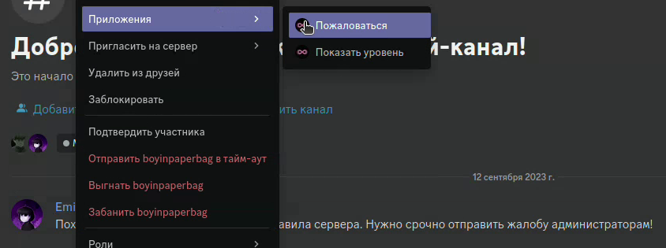
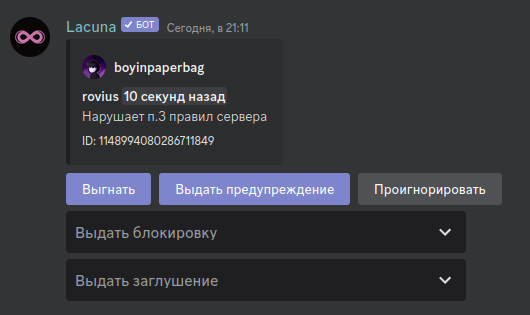
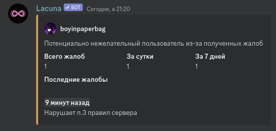

Репорты — это способ сообщить администрации сервера о пользователе, который нарушает общие правила Discord или конкретно сервера.

Для использования на сервере репорты должны быть включены во вкладке **"Полезное"** панели управления. Там же необходимо установить канал для сообщений.

Cамо же **использование** репортов происходит через использование слеш-команды `/report`.

Или через контекстное меню пользователя: ПКМ по пользователю -> Приложения -> Пожаловаться. Его можно открыть как в списке участников, так и в самом канале.

В случае, если вы отправляете жалобу через контекстное меню, в открывшемся модальном окне вам необходимо ввести причину жалобы и нажать кнопку "Отправить".

После чего в ранее настроенном канале отобразится информация о репорте.

С помощью кнопок вы можете выбрать, какое наказание выдать участнику. Для блокировки и заглушения вы также можете выбрать время наказания с помощью выпадающих списков.

Если же вы считаете, что участнику не нужно выдавать наказание, вы можете нажать кнопку **Проигнорировать**, однако учтите, что после её нажатия выдача наказаний с помощью вышеупомянутых кнопок и выпадающих списков будет недоступна.

## Уведомления о присоединении потенциально нежелательных пользователей

Если в панели включена опция **Уведомлять о присоединении потенциально нежелательных пользователей**, то Лакуна будет отправлять сообщения о том, что на новоприбывшего участника когда-либо отправлялись жалобы. Эти сообщения отправляются ботом в тот же канал, что и жалобы участников сервера.

В сообщении отображается общее количество жалоб, их количество за последние сутки и за последние 7 дней, а также информация о нескольких последних жалобах: когда были отправлены и по какой причине.

