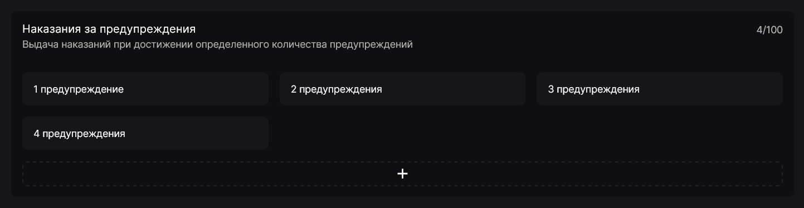
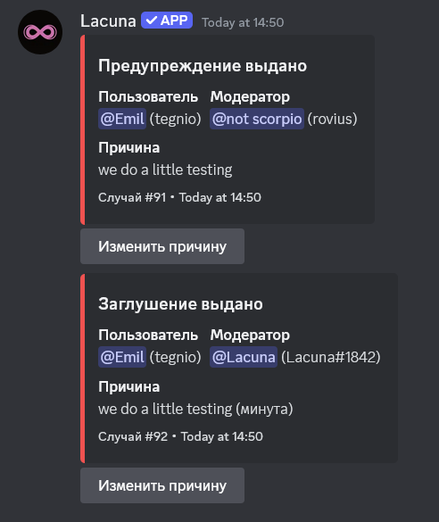

В настройках модерации имеется опция "Наказания за предупреждения". Она позволяет автоматизировать часть наказаний, отслеживая количество выданных участнику предупреждений и на их основе выдавая указанные в панели наказания.

Для создания автоматического наказания нажмите на кнопку **"+"** внизу блока. Откроется окно конфигурации наказания, в котором необходимо указать количество предупреждений для срабатывания (от 1 до 100), а также выдаваемое наказание:

- выгнать с сервера;
- обнулить предупреждения (полезно при изгнании или блокировке);
- выдать блокировку;
- выдать заглушение;
- изменить роли;
- отправить сообщение.

После чего нажмите кнопку **Добавить**, и новое автоматическое наказание отобразится в списке. Оно будет выполнено, как только один из участников достигнет указанного числа предупреждений.

Автоматические наказания, так же, как и ручные, попадают в журнал модерации, записываются как отдельный случай и имеют возможность смены причины случая.
