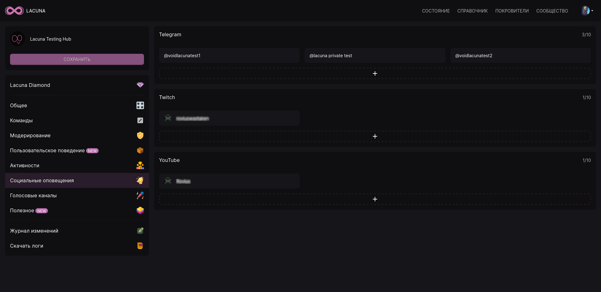
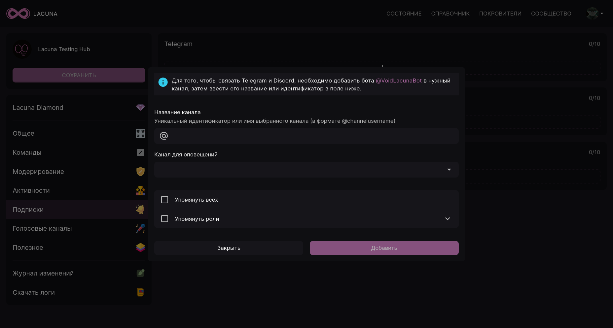
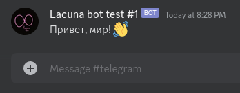
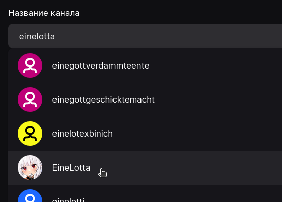
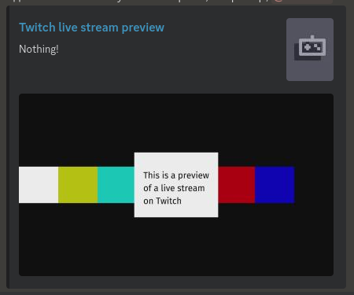

Социальные оповещения позволяют вам отслеживать каналы Telegram, Twitch и YouTube прямо на вашем Discord-сервере. Когда на каком-либо из добавленных каналов появится новая запись, видео или начнётся прямая трансляция, Лакуна оповестит вас и участников вашего сервера в заданном канале.

Настройка и управление происходит в панели управления на вкладке **Социальные оповещения**.

:::info

Бесплатный функционал Lacuna позволяет добавлять по одному оповещению для каждой из перечисленных выше платформ. Активировав подписку Lacuna Diamond, вы сможете добавлять до 10 оповещений на каждую из платформ.

:::

Рассмотрим добавление подписки для каждой из поддерживаемых платформ.

:::tip

Воспользуйтесь [руководством по получению идентификаторов](./guides/identifiers.md), чтобы указать имена каналов.

:::

## Telegram {#telegram}

### Добавление бота в Telegram-канал {#telegram-add-bot}

:::note

Перед добавлением убедитесь, что вы выбрали _канал_, а не _группу_, т.к. Лакуна поддерживает пересылку сообщений только из каналов.

:::

Для добавления оповещения из канала Telegram нужно сначала добавить Лакуну в необходимый Telegram-канал. Для этого:

1. Откройте в Telegram необходимый канал;
2. Перейдите в настройки канала ("управление каналом");
3. Откройте раздел "Подписчики" и нажмите кнопку "Добавить пользователей";
4. В строке поиска введите `@VoidLacunaBot`, выберите бота Lacuna и подтвердите его присоединение к каналу.

### Создание оповещения {#telegram-create-alert}

После добавления бота в Telegram нажмите на **+** в панели управления.

В "Название канала" вам нужно ввести имя выбранного канала, если он открытый, или идентификатор в случае с закрытым.

В поле "Канал для оповещений" вам нужно выбрать канал на сервере, в который Лакуна будет пересылать сообщения. Также вы можете добавить к сообщению упоминание всех участников (@everyone) или отдельных ролей (максимум 3). В данном случае к пересылаемым сообщениям будут добавляться упоминания выбранных вами ролей.

После завершения настройки нажмите кнопку Добавить. Подписка появится в панели управления, а на сервере в выбранном канале Лакуна создаст вебхук.

### Пример использования {#telegram-usage-example}

Теперь вы можете написать что-либо в Telegram канал, и Лакуна отправит это сообщение в Discord:

:::info

Лакуна поддерживает лишь некоторые типы сообщений, а именно:

- Обычные текстовые сообщения;
- Медиафайлы до 5 МБ;
- Голосовые сообщения.

Сообщения остальных типов (например, опрос или геолокация) не будут пересылаться в Discord.

:::

## Twitch

Для создания оповещения Twitch откройте окно добавления Twitch-канала в панели управления.

Вставьте или введите имя пользователя в поле "Название канала" **и выберите необходимый канал из списка**:

В поле "Канал для оповещений" укажите канал, в который будут поступать уведомления о начале прямой трансляции.

Затем, если необходимо, отметьте галочкой поле "Показывать предпросмотр стрима". Если данная опция включена, то Лакуна будет добавлять предпросмотр трансляции к каждому уведомлению:

В "Текст оповещения" указывается сообщение, которое отправляет бот в заданный канал. Оно может включать [заменители категории "Подписки"](./useful/replacers/#subscriptions).

## YouTube

Подписки YouTube работают точно таким же образом, как и Twitch, однако учтите, что для YouTube уведомления отправляются не только для прямых трансляций, но также для видео и Shorts.
