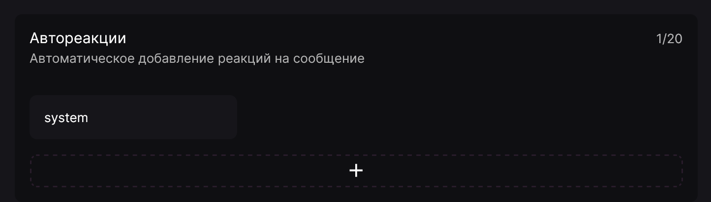

Функция "Автореакции" позволяет автоматически добавлять реакции на сообщения определённых типов. Эта функция находится на вкладке **"Полезное"** панели управления.

Для создания триггера автореакции необходимо указать:

- канал для отслеживания сообщений;
- реакции, которые необходимо добавить (можно выбрать до 10 реакций, в том числе серверные эмоджи);
- типы сообщения, на которые необходимо добавлять реакции (можно оставить поле пустым для отслеживания всех типов):
  - Стандартное сообщение
  - Сообщение закреплено
  - Участник присоединился
  - Буст сервера (1/2/3 уровень)
  - Подписка на канал
  - Создание ветки
  - Ответ на сообщение
- совпадения в тексте сообщения (необязательный параметр, разделяются с помощью клавиши Enter);
- исключённые совпадения в тексте (необязательный параметр, разделяются с помощью клавиши Enter).
