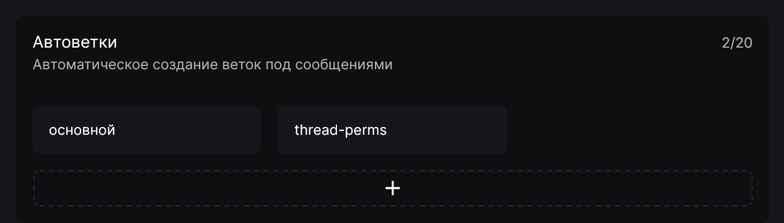

Функция "Автоветки" позволяет автоматизировать создание веток под сообщениями в заданном канале. Находится эта функция в разделе **"Полезное"**.

Чтобы создать триггер, необходимо указать:

- канал, который необходимо отслеживать;
- название ветки (поддерживаются [заменители](../useful/replacers/data-types/README.mdx) и [альтернация значений](../useful/replacers/README.mdx#values-alternation));
- совпадения в тексте сообщения (необязательный параметр, разделяются с помощью клавиши Enter);
- исключённые совпадения в тексте (необязательный параметр, разделяются с помощью клавиши Enter).
