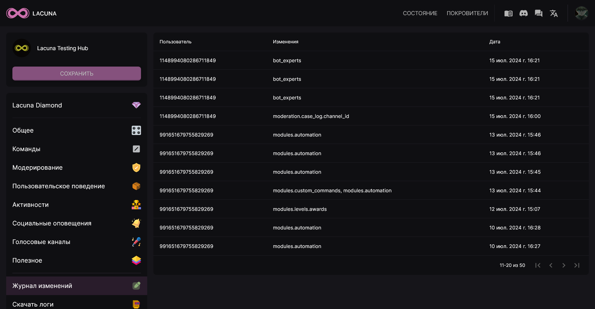

"Журнал изменений" - это функция, позволяющая вам отследить, кто из администраторов или назначенных экспертов по боту производил изменения в настройках бота.

Этот журнал хранит последние 50 изменений. Каждое из них содержит дату совершения действия, идентификатор автора этого действия, а также перечень параметров, которые были изменены.
