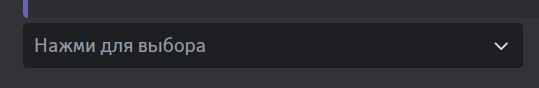

Интерактивные сообщения похожи на [интерактивные реакции](interactive-reactions.mdx), но к интерактивным сообщениям, помимо реакций, вы можете прикреплять кнопки и выпадающие списки.

## Создание интерактивного сообщения \{#create-interactive-message}

Для создания интерактивного сообщения откройте панель управления и перейдите на вкладку **"Полезное"**. Внизу вы найдёте блок **"Интерактивные сообщения"** и под ним кнопку **"+"** - нажмите на неё, чтобы начать настройку.

Затем вам нужно выбрать канал для отправки и указать текст сообщения, которое будет отправлено.

После этого нужно добавить операционный ряд (не важно, кнопки или выпадающий список) и настроить его по своему вкусу.

:::tip

Для кнопок и опций выпадающего списка предусмотрены следующие действия:

- Отправить эфемерное сообщение;
- Изменить роли;
- Переопределить права канала;
- Запретить выполнение ролям.

Для реакций доступны действия:

- Изменить роли;
- Переопределить права канала;
- Запретить выполнение ролям.

Обратите внимание, что изменение ролей выполняется относительно участника, нажавшего на реакцию/кнопку/пункт выпадающего списка.

:::

:::info

Использование триггеров автоматизаций с элементами интерактивного сообщения невозможно.

:::

Выпадающий список может иметь заполнитель - текст, который показывается в приложении, когда пользователем не выбран пункт:

В то время как кнопки могут содержать эмоджи в дополнение к тексту. Кроме того, для кнопок доступно несколько стилей оформления и возможность указать переход на указанную веб-страницу вместо выполнения действия в приложении.

Чтобы создать сообщение, необходимо выбрать канал, сообщение не должно быть пустым, должен быть хотя бы один операционный ряд, все кнопки/опции/реакции должны выполнять какое-либо действие.
