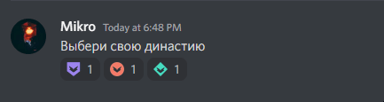

# Интерактивные реакции

## Создание элемента реакции 

Чтобы создать элемент реакции, вам понадобится включенный режим разработчика в настройках учетной записи Discord для получения идентификатора сообщения.

Заготовьте сообщение в нужном текстовом канале и скопируйте идентификатор.

content-ref url="../guides/identifiers/"
[identifiers](../guides/identifiers/)
endcontent-ref

Перейдите в панель управления своего сервера, откройте страницу **"Полезное"**, снизу будет пункт **"Интерактивные реакции"** и кнопка **"+"** – нажмите на неё. У вас откроется окно создания элемента реакции.

Тип может быть **"Роль"** и **"Канал"**. Тип **"Роль"** отвечает за выдачу и снятие ролей участника, тип **"Канал"** за открытие и закрытие доступов к каналам и категориям.

**"Одиночный режим"** позволяет сделать элемент реакции уникальным, т.е. если участник уже имеет роли из одного одиночного элемента, то он не сможет получить другие, пока не снимет с себя текущие. Доступно только для типа **"Роль"**.

**"Реверсивный элемент"** как понятно из названия, реверсирует элемент и убирает роли, вместо выдачи или показывает каналы или категории, вместо скрытия.

В поле **"Канал"** нужно выбрать канал, в котором находится сообщение на которое вы хотите добавить реакции.

В поле **"Идентификатор сообщения"** нужно вставить скопированный идентификатор сообщения, на которое будет добавлена реакция.

В поле **"Эмодзи"** необходимо выбрать реакцию, которая будет добавлена на сообщение.

В поле **"Направления"** нужно выбрать роли, которые будут выданы или убраны при нажатии на реакцию или выбрать каналы, если указан тип реакции **"Канал"**.

:::info
**Важно!** Сообщение должно находится в указанном канале. Если сообщение не будет найдено, то будет выдана ошибка.
:::

После успешного добавления, на указанном сообщении появится реакция с указанным эмоджи. Нажмите на реакцию, чтобы проверить работоспособность.
