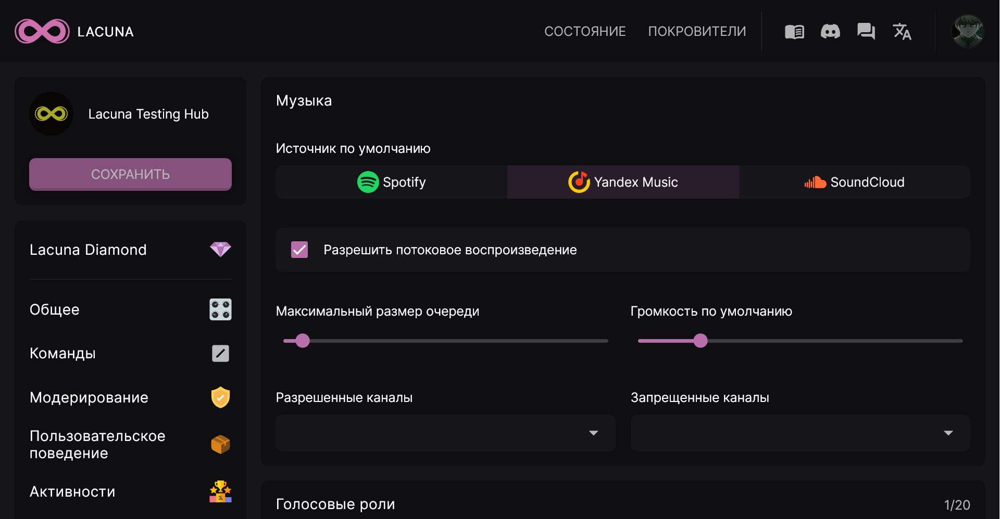
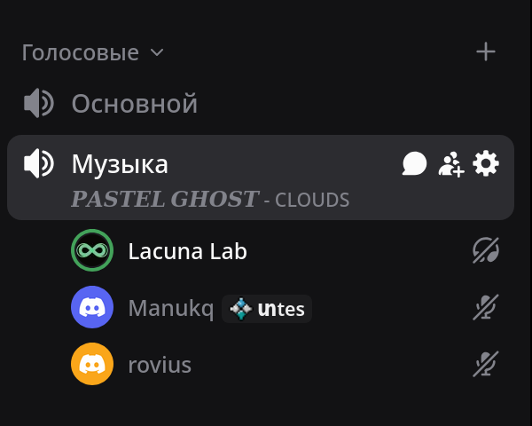
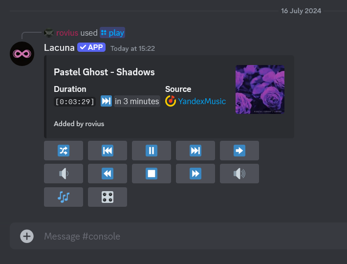

## Настройки \{#settings}

### Источник по умолчанию \{#settings-default-source}

В настройках модуля вы можете выбрать источник по умолчанию - Spotify, Яндекс.Музыка или SoundCloud. Этот параметр влияет на то, с какого ресурса Лакуна будет загружать песню, если пользователь предоставил не ссылку, а поисковый запрос. Если пользователь вводит команду `/play` со ссылкой на песню, то будет использоваться тот источник, что укажет участник.

### Потоковое воспроизведение \{#settings-streaming}

Если ваш сервер имеет подписку Diamond, вы можете включить опцию "Потоковое воспроизведение", которая разрешает воспроизведение радиостанций.

### Показывать текущий трек в статусе голосового канала \{#settings-voice-status}

Этот параметр позволяет отображать текущий проигрываемый трек под названием голосового канала (в его статусе).

:::info

Для корректной работы этой опции Лакуна должна иметь разрешение _Задавать статус голосового канала_.

:::

### Максимальный размер очереди \{#settings-max-queue-size}

Если ваш сервер имеет подписку Diamond, вы можете регулировать максимальный размер очереди воспроизведения. Для серверов без подписки количество треков в очереди может быть не более 15.

### Громкость по умолчанию \{#settings-default-volume}

При наличии на сервере активной подписки Diamond вы можете регулировать громкость, которая будет устанавливаться при присоединении Лакуны к голосовому каналу.

### Разрешённые/запрещённые каналы \{#settings-allowed-denied-channels}

Эти параметры определяют, в каких каналах участники могут начать воспроизведение музыки. Подробнее о принципе работы разрешений см. [Разрешения](../guides/permissions.mdx)

## Использование \{#usage}

Для начала воспроизведения введите команду `/play` на сервере. Лакуна присоединится к голосовому каналу, в котором вы находитесь и загрузит песню из поддерживаемого источника, после чего вам будет доступны различные параметры для управления воспроизведением, такие как пауза, остановка воспроизведения, повтор очереди или одного трека, перемотка, переход к следующему или предыдущему треку, изменение громкости, добавление и удаление фильтров, просмотр и перемешивание очереди воспроизведения.

