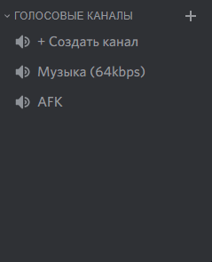

Временные голосовые каналы позволяют участникам подключиться к каналу-триггеру, откуда они будут перемещены в отдельный временный канал, который будет удалён автоматически, как только из него выйдут все участники.

## Добавление голосового триггера {#add-voice-trigger}

Создайте голосовой канал или выберите существующий и скопируйте его идентификатор.

content-ref url="../guides/identifiers/"
[identifiers](../guides/identifiers/)
endcontent-ref

Затем перейдите в панель управления сервера во вкладку **"Голосовые каналы"** и нажмите на кнопку **"+"** в секции **"Временные голосовые каналы"**. У вас откроется окно добавления голосового триггера.

В поле **"Голосовой канал"** нужно выбрать канал при подключении к которому будет создаваться новый.

Поле **"Название"** используется для названий новых созданных голосовых каналов. Вы можете использовать заменители.

content-ref url="replacers/"
[replacers](replacers/)
endcontent-ref

Ползунок **"Ограничение пользователей"** устанавливает стандартное количество пользователей в созданном голосовом канале. 0 – неограниченное количество пользователей.

В поле **"Категория"** можно выбрать категорию, в которой будут создаваться голосовые каналы.

В поле **"Позиция"** можно выбрать позицию для временных голосовых каналов.

В пункте **"Разрешения владельца канала"** можно выбрать права, которые получит владелец голосового канала, т.е. пользователь, который подключился к голосовому триггеру.

**"Разрешенные роли"** и **"Запрещенные роли"** – в этих полях можно ограничить роли, которые могут использовать голосовой триггер и создавать временные голосовые каналы.

Поле **"Роли модераторов"** позволяет получить те же права, что и владелец канала для выбранных ролей, только для них нельзя будет изменить разрешения во временном голосовом канале. Для корректной работы, боту необходимо право администратора.

Попробуйте подключиться к голосовому триггеру, чтобы проверить работоспособность.

## Полезная информация {#useful-info}

Если пользователь попытается снова подключиться к голосовому триггеру, то его автоматически перенесет в уже созданный временный голосовой канал. Владелец временного голосового канала меняется при условии, если в голосовом канале больше одного участника и текущий владелец отключился или был перемещен в другой голосовой канал.

Если же в голосовом канале только один участник и он отключился, то в этом случае временный голосовой канал удалится.

## Удаление голосового триггера {#remove-voice-trigger}

Если вы захотите удалить голосовой триггер, **помните, если вы удалите его, то все текущие временные голосовые каналы этого триггера останутся и не будут удалены автоматически!**

## Частые вопросы {#faq}

### Q: Я даю владельцу временного голосового канала право управления каналами, но у него не получается войти в настройки. Что делать? {#faq1}

Посмотрите, требуется ли на вашем сервере наличие у пользователей двухфакторной аутентификации (2FA). Оно не позволяет совершать изгнание из сервера, блокировку и заглушение участников сервера, а также редактировать каналы тем пользователям, у которых нет 2FA. Для решения проблемы просто оповестите пользователей о требовании или отключите его.
