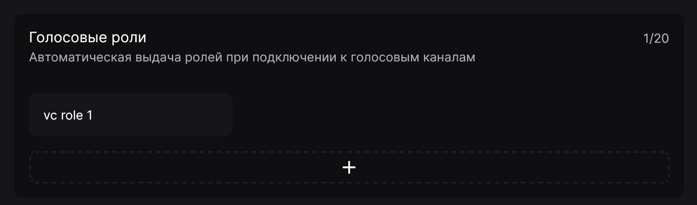

Функция **"Голосовые роли"** позволяет настроить автоматическую выдачу ролей при подключении участника сервера к голосовому каналу. Настроить её можно в панели управления в разделе **"Голосовые каналы"** в блоке **"Голосовые роли"**.

Для её настройки нужно всего лишь указать необходимую роль для выдачи и канал (каналы), за которыми боту необходимо следить. Вы также можете оставить список каналов пустым, чтобы выдача роли срабатывала при подключении к любому голосовому каналу.

После добавления триггера в панели вы сможете зайти в указанный голосовой канал на сервере (или любой, если список оставлен пустым) и Лакуна выдаст указанную роль. При выходе из канала роль будет автоматически убрана.
